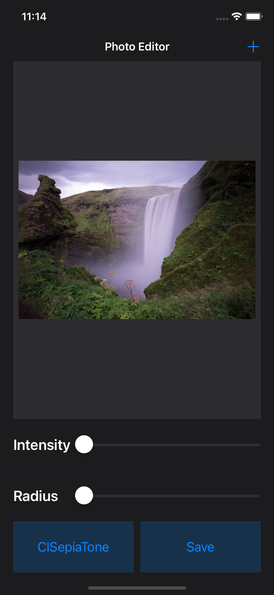
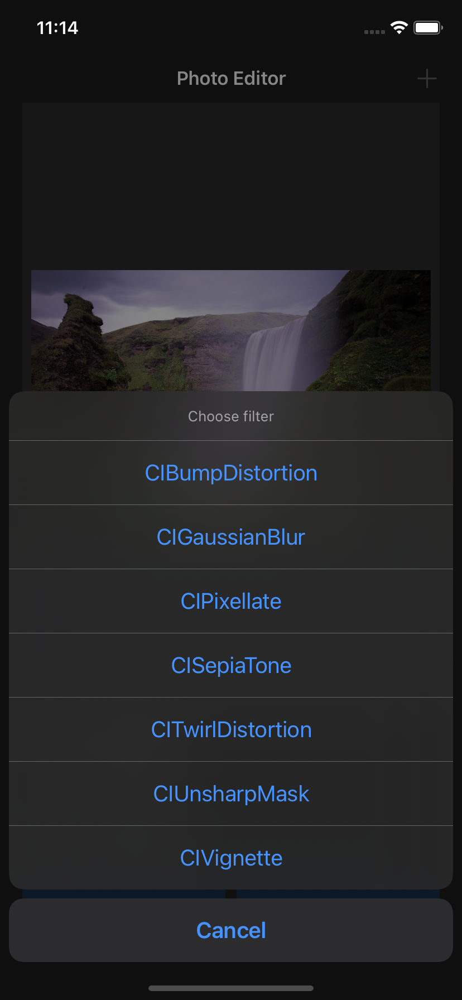

# PhotoEditor 🖋
PhotoEditor is a UIKit app designed to edit, and save, photos from your library using filters from Apple's **CoreImage** library.

## Screenshots & Demo
| Photo Editor | Filters | Demo |
| --- | --- | --- |
|  |  |  |
